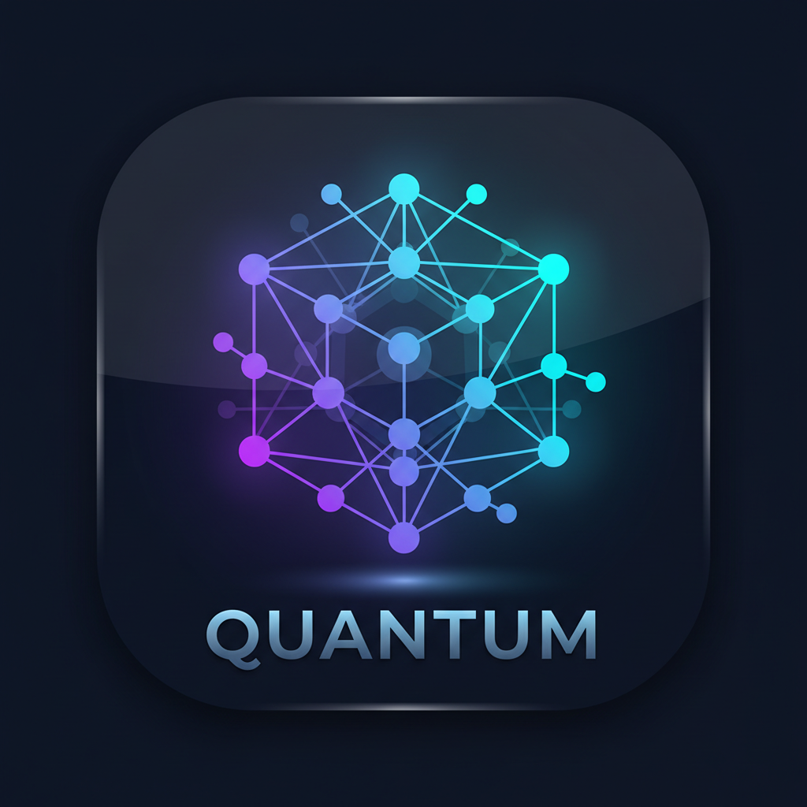

# ModelQuantizer

An experimental iOS app for downloading compatible Hugging Face model files and converting/quantizing them to GGUF on-device. Built with SwiftUI.



## Features

### On-Device Quantization (Current Build)
- **Implemented quantizers**: Q4_0, Q4_1, Q8_0, FP16, FP32
- **Hugging Face Integration**: Search and download models directly from Hugging Face Hub
- **Architecture Support**: Llama, Mistral, Qwen2, Gemma, Phi, Falcon, GPT-2, BERT
- **Real Progress**: Live progress tracking during download, analysis, and quantization
- **GGUF Export**: Outputs industry-standard GGUF format for use with llama.cpp

### Device Intelligence
- **Automatic Device Scanning**: Detects your iPhone/iPad model, RAM, CPU cores, GPU capabilities, and Neural Engine
- **Smart Recommendations**: Suggests optimal quantization settings based on your device's capabilities
- **Thermal Monitoring**: Adjusts settings based on device temperature and battery state

### Beautiful UI/UX
- **Liquid Glass Design**: iOS 26-inspired glassmorphism with animated backgrounds
- **Dark Mode First**: Optimized for OLED displays with deep blacks
- **Smooth Animations**: Spring-based transitions and shimmer effects
- **Responsive Layout**: Adapts to all iPhone and iPad sizes

### Model Library
- **Real Model Search**: Search Hugging Face's entire model repository
- **Curated Models**: Pre-loaded with popular open-source models
- **Detailed Info**: View parameters, downloads, likes, and supported quantizations
- **One-Tap Quantize**: Start quantization directly from model details

## Current Limitations (Important)

- This project is **experimental** and does not yet implement full llama.cpp parity.
- Quantization quality and output compatibility can vary by architecture/model checkpoint.
- Only the quantizers listed in this README are implemented in this build.
- Verify generated GGUF files in your target runtime before production use.

## Requirements

- iOS 18.0+
- iPhone 11 or later (recommended)
- Metal-capable device
- At least 4GB RAM for 7B models
- Hugging Face token for gated models (like Llama)

## Installation

### Sideloading (Recommended)

1. Download the latest IPA from GitHub Releases
2. Use AltStore, Sideloadly, or TrollStore to install
3. Trust the developer certificate in Settings

### Building from Source

```bash
git clone https://github.com/NightVibes3/ModelQuantizer-iOS.git
cd ModelQuantizer-iOS
open ModelQuantizer.xcodeproj
```

Build and run on your device (requires Apple Developer account for signing).

## Usage

### 1. Home Dashboard
- View your device capabilities at a glance
- See recommended quantization settings
- Access your quantized models
- View recent activity

### 2. Quantize a Model
1. Tap "Quantize" in the tab bar
2. Search for a model on Hugging Face (or select from popular models)
3. Select quantization type (or use recommended)
4. Adjust context length if needed
5. Tap "Start Quantization"
6. Wait for completion

### 3. Hugging Face Authentication
Some models (like Llama) require authentication:
1. Go to Settings tab
2. Enter your Hugging Face token (get it from huggingface.co/settings/tokens)
3. Now you can download gated models

### 4. View Device Info
- Detailed hardware specifications
- ML capabilities (Neural Engine, Metal features)
- Performance recommendations
- Supported model sizes

### 5. Browse Model Library
- View all your quantized models
- Share or export models
- Delete unwanted models

## Quantization Types

| Type | Bits | Compression | Quality | Use Case |
|------|------|-------------|---------|----------|
| Q4_0 | 4 | 8× | Good | Fast 4-bit |
| Q4_1 | 4 | 8× | Better | Better 4-bit accuracy |
| Q8_0 | 8 | 4× | Near-Perfect | Maximum quality |
| FP16 | 16 | 2× | Original | Research/development |
| FP32 | 32 | 1× | Original | Baseline/uncompressed |

## Device Compatibility

### Ultra (iPhone 16 Pro/Max, iPad Pro M4)
- **Max Model Size**: 24GB
- **Recommended**: Q8_0 quantization
- **Context**: Up to 32K tokens
- **Features**: Full Neural Engine, all GPU layers

### Flagship (iPhone 16/15 Pro)
- **Max Model Size**: 12GB
- **Recommended**: Q4_1 to Q8_0 quantization
- **Context**: Up to 16K tokens
- **Features**: Neural Engine, most GPU layers

### High-End (iPhone 14/13 Pro)
- **Max Model Size**: 7GB
- **Recommended**: Q4 quantization
- **Context**: Up to 8K tokens
- **Features**: GPU acceleration

### Mid-Range (iPhone 12/11)
- **Max Model Size**: 4GB
- **Recommended**: Q4_0 quantization
- **Context**: Up to 4K tokens
- **Features**: Limited GPU

### Entry-Level
- **Max Model Size**: 2GB
- **Recommended**: Q4_0 quantization
- **Context**: Up to 2K tokens
- **Features**: CPU only

## Technical Details

### Architecture
- **Swift 6.0**: Modern Swift with concurrency support
- **SwiftUI**: Declarative UI with 95%+ Swift code
- **Metal**: GPU acceleration for quantization operations
- **Core ML**: Neural Engine utilization where available

### Quantization Engine
- Custom GGUF writer implementation
- Real tensor analysis and quantization
- Memory-mapped file I/O
- Progressive quantization with checkpointing
- Support for Q4_0, Q4_1, Q8_0, FP16, FP32

### Performance
- Background processing with progress callbacks
- Thermal throttling awareness
- Battery level monitoring
- Automatic memory management

## Roadmap

- [x] Hugging Face Hub integration
- [x] Real model quantization
- [ ] Cloud quantization (offload heavy models)
- [ ] Model comparison tool
- [ ] Benchmark suite
- [ ] Custom model import
- [ ] Batch quantization
- [ ] iCloud sync for models

## Contributing

Contributions are welcome! Please read our [Contributing Guide](CONTRIBUTING.md) for details.

## License

This project is licensed under the MIT License - see [LICENSE](LICENSE) for details.

## Acknowledgments

- [llama.cpp](https://github.com/ggerganov/llama.cpp) for GGUF format
- [Hugging Face](https://huggingface.co) for the model hub
- [ggml](https://github.com/ggerganov/ggml) for quantization algorithms

## Disclaimer

This app is for educational and research purposes. Respect model licenses and terms of use. Some models require authentication or have commercial use restrictions.

---

Built with ❤️ for the AI community
